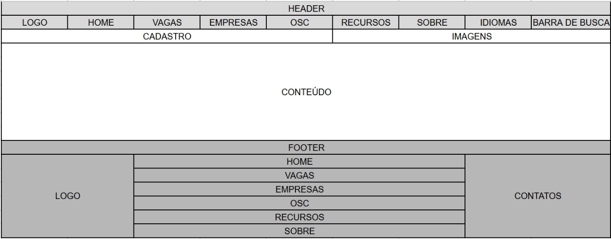
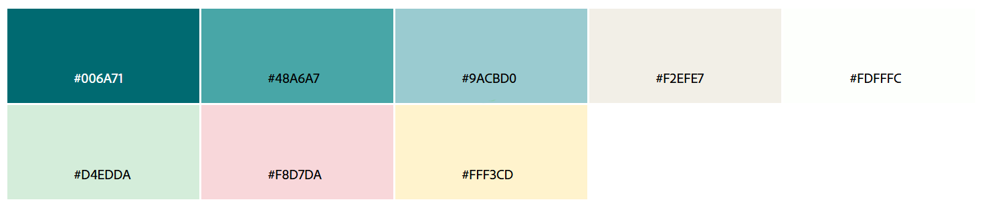
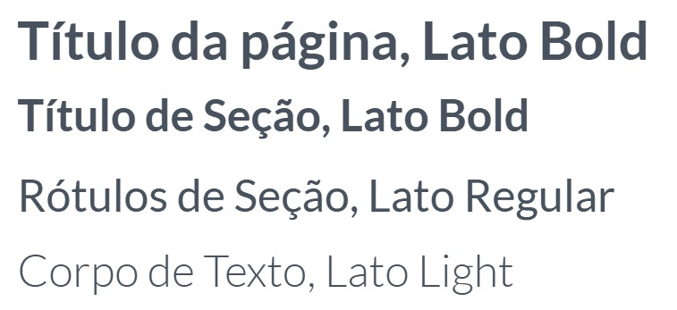
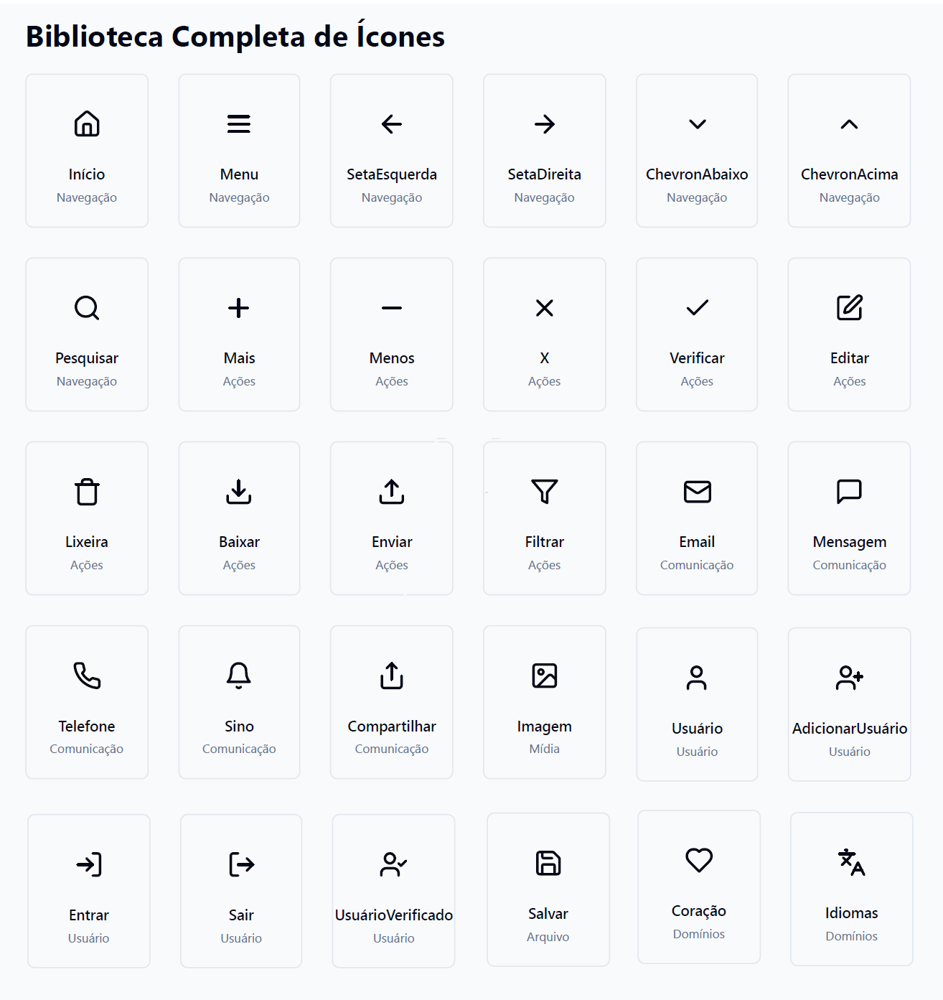

# Template padrão do site

O template padrão da plataforma Trabalho Sem Fronteiras seguirá suas diretrizes visuais e de acessibilidade, com o mínimo de elementos possíveis que permitem a exibição de todas as funcionalidades da página. 

## Design

O layout padrão da página será composta por: 1. header, no limite do canto superior, que conterá a 1.1 logo, 1.2, home, 1.3 vagas, 1.4, empresas, 1.5 OSC's, 1.6, recursos, 1.7 sobre, 1.8 idiomas, 1.9 barra de busca. 

Abaixo da header, estará as opções de cadastro ou login e uma caixa para o carrossel de imagens. 

Abaixo dessa seção intermediária, será exibido o conteúdo composto pelas seções de Sobre o projeto, Oportunidades em aberto, Empresas parceiras, Recursos adicionais e a repetição do cadastro ou login. 

Por fim, será exibido o footer (2), com as opções de 2.1 logo, 2.2 home, 2.3 vagas, 2.4 empresas, 2.5 OSC's, 2.6 recursos e 2.7 sobre. 

## Cores

A paleta de cores escolhida foi pensada para refletir sobriedade, considerando-se que a plataforma será para busca de oportunidades e divulgação de empresas e recursos de apoio às pessoas em deslocamento. 

1. Como cor primária, utilizaremos a #006A71, para os botões e notificações. 
2. A cor secundária, para a header, será #9ACBD0. 
3. Para o footer, foi escolhida a cor #48A6A7. 
4. Para o corpo, foram escolhidas as cores #F2EFE7 e #FDFFFC. 
5. Para as cores de alerta, foram escolhidas as cores #D4EDDA, #F8D7DA e #FFF3CD. 

## Tipografia

A tipografia será composta por: 

1. Para o Título de página, será a utilizada a fonte Lato Bold. 
2. Para o Título de Seção, será utilizada a fonte Lato Bold. 
3. Para os Rótulos de componentes, será utilizada a fonte Lato Regular.
4. Para o Corpo de Texto, será utilizada a fonte Lato Light.

## Iconografia

A iconografia considerou os requisitos funcionais, como botões para favoritar (coração), editar (lápis), checklist de documentos (check), entre outros. 

Apresente os estilos CSS criados para cada um dos elementos apresentados.

